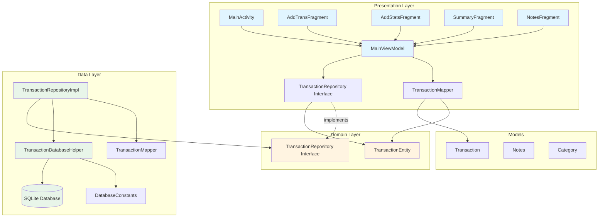
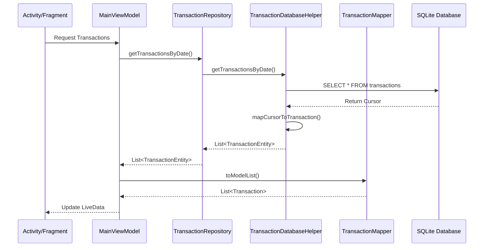
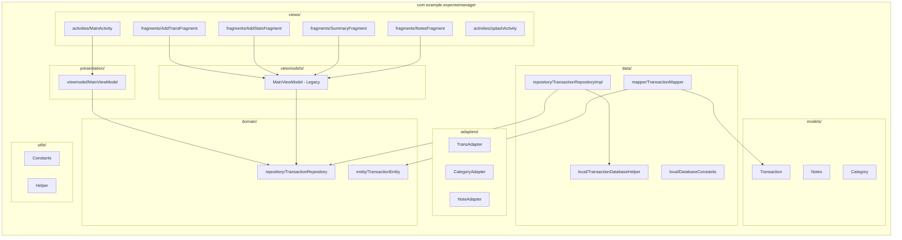
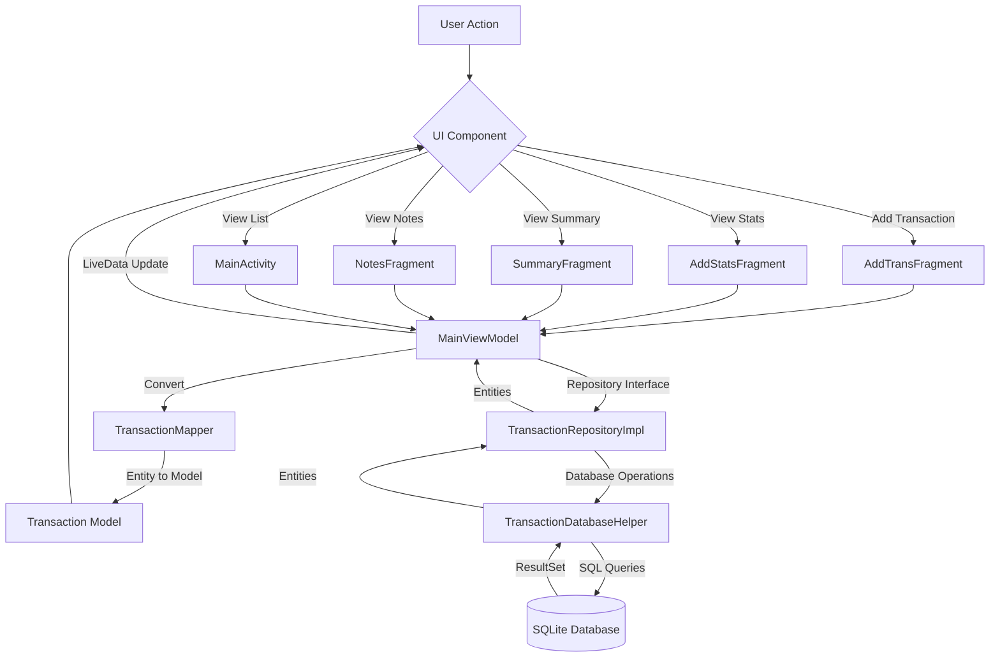
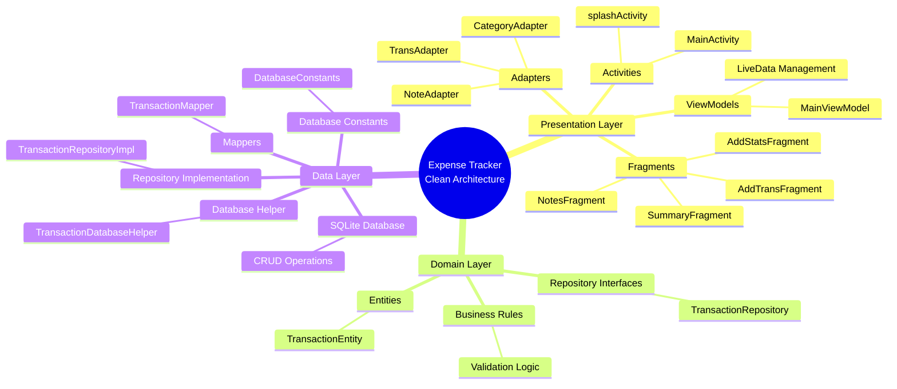
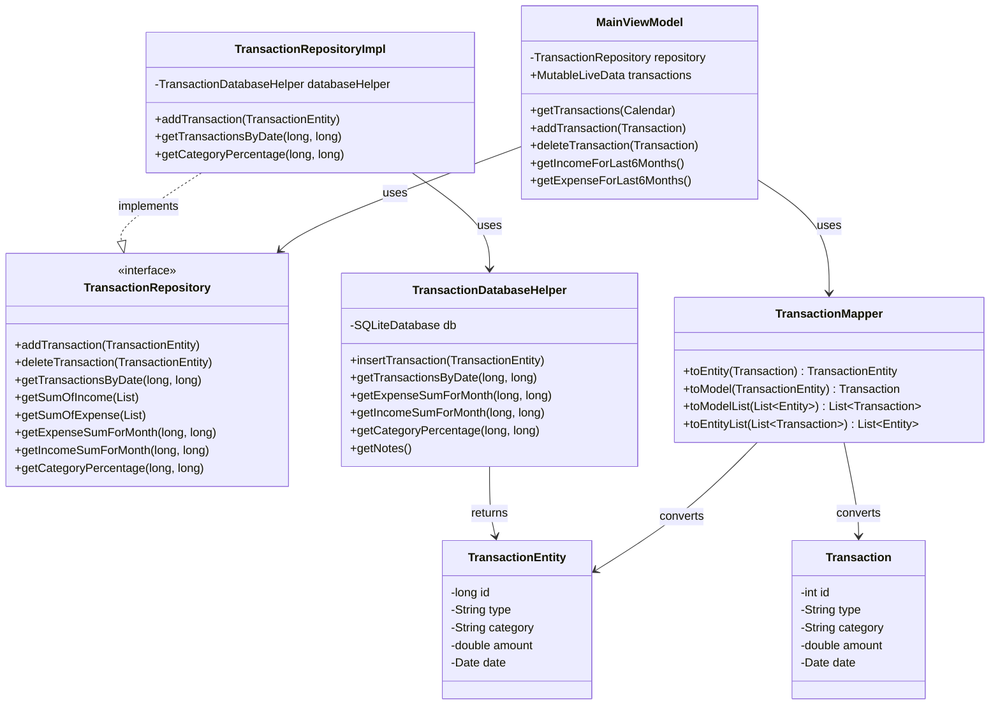
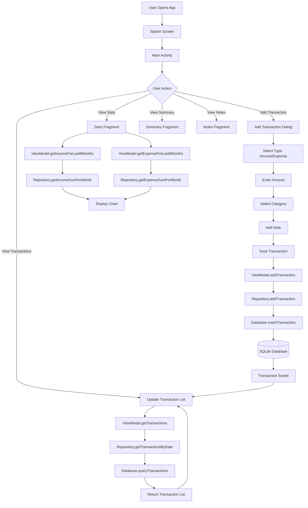

# Expense Tracker App - System Architecture Diagram

## System Architecture Overview

## Component Interaction Flow

## Package Structure Diagram

## Data Flow Diagram

## Layer Responsibilities

## Class Dependency Diagram

## Use Case Flow

